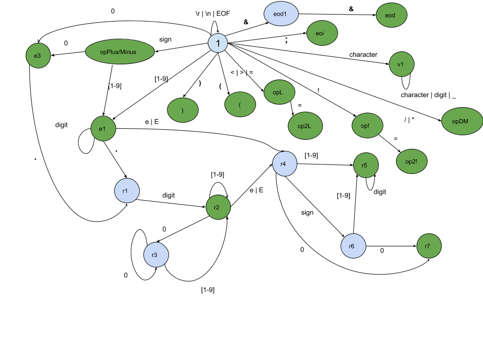

# Scanner

This program is the responsible of reading character by character the input file and grouping then into ***lexical units*** which
are also called ***tokens*** and each token is a structure that follows this pattern: (lexeme,morpheme).

The lexeme is the lexical class that a token belongs and the morpheme is the value of the token.

Example:

|__Lexical class__|         __Possible values__             |
|-----------------|----------------------------------------|
| operator        | ```+```,```-```,```*```                |
| keyword         | ```while```,```if```,```return```      |
| literal         | ```true```,```10```,```"Hello World"```|
| comments        | ```//this is a comment```              |

The scanner returns a token which contains the lexical class and zero or more attributes like the value and the number of
the column and row where the token was accepted.

Each lexical class has to be predefined by the programming language and the method to accept the token is through a ***finite
deterministic automaton*** and because of that we have to use ***regular expressions*** to define each lexical class.

## Language Definition

We will consider a programming languague with the following requisites:

- It will have a section for declaring variables and another section for writing instructions. Both section will be separated by ```&&```
- The section for declaring variable it is made up by one or more declaration separated by ```;```
  - Each declaration is in the form of ```*type name* *variable name*;```
  - The allowed type names are:
    - int
    - real
    - bool
  - The variable name has to have the following structure: 
    - It has to start with a letter and before that it can have a sequence of zero or more letters, digits or underscore ( **_** )
- The section for writing instructions it is made up by one or more instructions separated by ```;``` and each 
instruction must be an assignment.
  - Each assignment is in the form of ```*variable name* = *expression*;```
  - Each expression can employ operands with:
    - Integer numbers with or without the sign
    - Real numbers with or without the sign
    - Other variables
    - True or false
  - The Integer numbers starts (optionally) with a sign before a sequence of one or more digits (the use of zeroes
  at the left is forbidden)
  - The Real numbers starts (optionally) with a sign before an Integer number and be followed (optionally) by a decimal part and or an exponential part
    - The decimal part starts with a dot ( ***.*** ) before a sequence of one or more digits (the use of zeroes at the right is forbidden)
    - The exponential part starts with the letter **e** or **E** before an Integer number
  - The expressions can also employ some operators
    - Binary arithmetic operators ```+```, ```-```,```*```, ```/``` and logical ones like ```and``` and ```or```
    - Unary arithmetic operator ```-```, and logical ```not```
    - Relational operators ```<```,```<=```,```>```,```>=```,```==``` and ```!=```
  - It is also possible to use parenthesis to change the associativity and precedence of the operators.
#### Example

```
real weight;
bool heavy
&&
weight = (45.0 * 12e-56) / -2.05;
heavy = (weight > 10.0) or (weight / 2 <= +0.0)
```

## Lexical Classes's definition

One we know how a program is written, the next step is enumerate the lexical classes for our scanner. They will be written with regular
expressions and, to make them more readable, we will create some regular definitions.

### Regular definitions

- character = ```[a-z,A-Z]```

Characters from lower case a to z and form capitalize A to Z

- digit = ```[0-9]```

The ten digit from the decimal base

- integerOr0 = ```([1-9]digit\* | 0)```

A number starting with all but 0 and followed by a sequence of digits or just the 0

- decimal = ```.((digit)\*[1-9] | 0)```

It's the decimal part of a real number. It starts with a dot character and is followed by a sequence of numbers not allowing non
meaningless zeroes to the right or just he number 0

- exponencial = ```(e | E)integerOr0```

It's the exponential part of a real number. It starts with the character e or E and is followed by a number with the same structure as
integerOr0

- sign = ```(+ | -)```

This are the signs a sequence of number might have

### lexical classes

The name of the class is really intuitive of what set of elements it contains:

- operatorAdd = ```+```
- operatorMinus = ```-```
- operatorDiv = ```/```
- operatorMul = ```*```
- operatorLessThan = ```<```
- operatorLessEqualThan = ```<=```
- operatorGreaterThan = ```>```
- operatorGreaterEqualThan = ```>=```
- operatorEqual = ```==```
- operatorNotEqual = ```!=```
- operatorAssignment = ```=```
- type = ```(int | real | bool)```
- integerNum = ```sign?integerOr0```
- realNum = ```integerNum(decimal | exponencial | decimal·exponencial)```
- varName = ```character(character | digit | _)\*```
- eoi (End Of Instruction o declaration) = ```;```
- eod (End Of Declarations) = ```&&```
- openParenthesis = ```(```
- closeParenthesis = ```)```
- ignorable = ```(\n | \r | EOF)```

Once we define all our ***lexical classes***, the next step is create the ***finite deterministic automaton*** whose job is iterate
character by character through all our program file looking trying to create the corresponding token

## Finite Deterministic Automaton

Here, we will provide a diagram of our finite deterministic automaton for the given programming language.



The greens circle is the ***final state***.
1. v1 for a varName token
2. opX for  a operatorX token
3. e1 for an integer with o without sign where the left it can't have meaningless zeroes to it's left
4. e3 for an integer with or without sign whose value is just the zero
5. r2 for a real number with just it's decimal part
6. r5 for a real number with it's exponential part. It can have a decimal part as well
7. r7 for a real number with an exponent of just zero
8. eoi for the lexical class of end of instruction or declaration
9. eod for the lexical class of end of declarations

